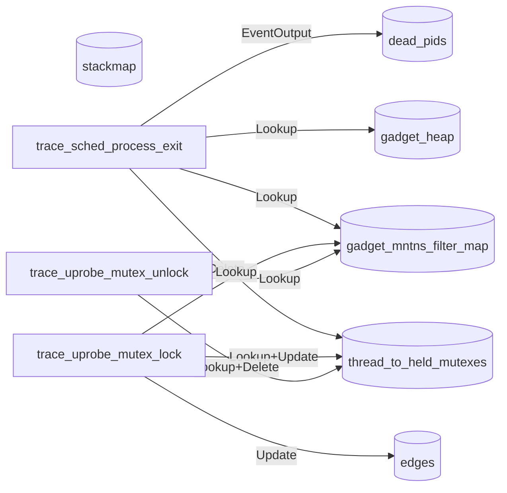
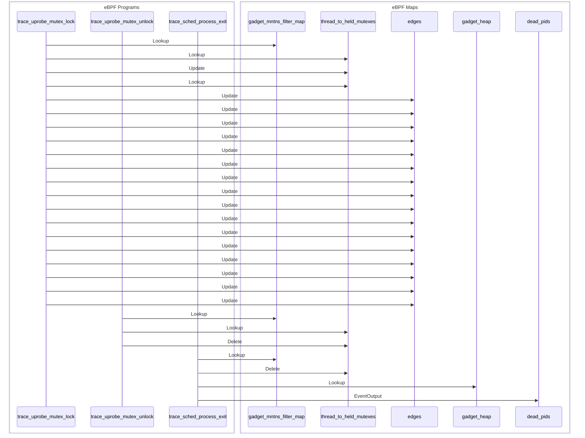

import Tabs from '@theme/Tabs';
import TabItem from '@theme/TabItem';

# deadlock

Use uprobe to trace pthread_mutex_lock and pthread_mutex_unlock in libc.so and detect potential deadlocks.

## Getting started

Running the gadget:

<Tabs groupId="env">
    <TabItem value="kubectl-gadget" label="kubectl gadget">
        ```bash
        $ kubectl gadget run ghcr.io/inspektor-gadget/gadget/deadlock:%IG_TAG% [flags]
        ```
    </TabItem>

    <TabItem value="ig" label="ig">
        ```bash
        $ sudo ig run ghcr.io/inspektor-gadget/gadget/deadlock:%IG_TAG% [flags]
        ```
    </TabItem>
</Tabs>

## Flags

### `--pid`

Show only events generated by processes with this pid

Default value: ""

## Guide

To generate mutex lock/unlock events, you can run a `test` program in another container.

For this example, we use a [test C++ program](https://github.com/iovisor/bcc/blob/master/tools/deadlock_example.txt#L187) (from BCC) with lock inversions that can cause a potential deadlock.

The deadlock gadget traces all potential deadlocks:
```bash
$ sudo ig run ghcr.io/inspektor-gadget/gadget/deadlock:%IG_TAG%
RUNTIME.CONTAINERNAME                                  PID NODES   STACK_IDS                                           COMM
hungry_montalcini                                    39046 3       [77, 13], [149, 42], [11, 109]                      test
hungry_montalcini                                    39046 4       [51, 208], [87, 52], [239, 71], [175, 35]           test
```

### Notes

- This gadget detects "potential" deadlocks and not just actual deadlocks as a deadlock that didn't happen during the trace could happen in the future.
A deadlock occurring depends on various factors such as thread scheduling and order of mutex acquisitions/releases, and hence it makes sense to report mutex lock order inversions as potentially unsafe resource management.
- Tracing with `--host` will slow down the gadget due to too many events.

## Program-Map Relationships

### Flowchart Graph

Mermaid graph showing relations between maps and programs


### Sequence Graph 

Mermaid graph showing the sequence of events

