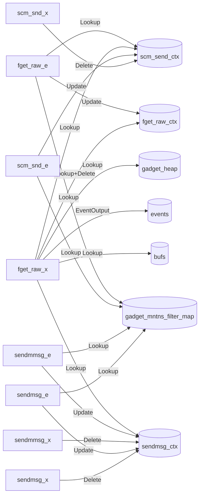
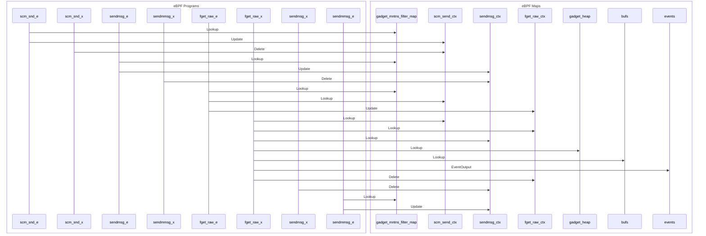

import Tabs from '@theme/Tabs';
import TabItem from '@theme/TabItem';

# fdpass

The fdpass gadget traces file descriptor passing via a unix socket (`SCM_RIGHTS`). Currently it only shows the sender side.

Unix sockets have the ability to send a file descriptor from one process to another using a mechanism called "fd passing" or SCM_RIGHTS. This is explained in the [Linux manual page unix(7)](https://man7.org/linux/man-pages/man7/unix.7.html).

Various applications use this mechanism for inter-process communication. In the guide below, we will see two applications using fd passing: D-Bus and runc.

## Getting started

Running the gadget:

<Tabs groupId="env">
    <TabItem value="kubectl-gadget" label="kubectl gadget">
        ```bash
        $ kubectl gadget run ghcr.io/inspektor-gadget/gadget/fdpass:%IG_TAG% [flags]
        ```
    </TabItem>

    <TabItem value="ig" label="ig">
        ```bash
        $ sudo ig run ghcr.io/inspektor-gadget/gadget/fdpass:%IG_TAG% [flags]
        ```
    </TabItem>
</Tabs>

## Flags

### `--target_pid`

Show only events generated by process with this PID

Default value: ""

## Guide

### Example with D-Bus

First, we need to run an application that generates some events. We will use an example application that sends a file descriptor over D-Bus.

```bash
$ git clone https://github.com/alban/godbus.git
$ cd godbus
$ git switch alban_passfd
```

Run the server:
```bash
$ go run _examples/server.go
```

In another terminal, run the client:
```bash
$ go run _examples/client.go
```

Observe the events:
```
$ sudo ig run ghcr.io/inspektor-gadget/gadget/fdpass:%IG_TAG% --host --fields proc.comm,proc.pid,socket_ino,sockfd,fd,file
COMM                    PID           SOCKET_INO     SOCKFD         FD FILE
client              1296790              8683452          7          3 /dev/null
dbus-broker            5128              8629627        107        112 /dev/null
```

The client sends the file descriptor for `/dev/null` to the server via dbus-broker.

### Example with Docker

Docker uses fd passing to [initialize new pseudo-terminal](https://github.com/opencontainers/runc/blob/main/docs/terminals.md#detached-new-terminal). Let's start a docker container and observe the how runc initialize the container:

```bash
docker run -ti --rm busybox
```

```bash
$ sudo ig run ghcr.io/inspektor-gadget/gadget/fdpass:%IG_TAG% --host --fields proc.comm,proc.pid,socket_ino,sockfd,fd,file
COMM                    PID           SOCKET_INO     SOCKFD         FD FILE
runc:[2:INIT]       1311501              8744858          3          7 /dev/pts/ptmx
```

### Example with the Linux Bluetooth stack

The Bluetooth stack on Linux uses fd passing to pass a `AF_BLUETOOTH` socket to
other processes.

Connect a Bluetooth headset while running the fdpass gadget:
```
$ sudo ig run ghcr.io/inspektor-gadget/gadget/fdpass:%IG_TAG% --host --fields proc.comm,proc.pid,socket_ino,sockfd,fd,file
COMM                    PID           SOCKET_INO     SOCKFD         FD FILE
bluetoothd             1231                28962          7         30 RFCOMM
dbus-broker            1227                40373         82         55 RFCOMM
pipewire               5353                43027         35         58 memfd:pipewire-memfd:flags=0x0000000f,type=2,size=2312
pipewire               5353                43027         35         59 [eventfd]
pipewire               5353                43027         35         60 [eventfd]
pipewire               5353                43027         35         61 [eventfd]
pipewire               5353                43027         35         63 [eventfd]
systemd-logind         1257              8826380         45         44 /dev/input/event21
systemd-logind         1257                29754         13         45 /dev/input/event21
dbus-broker            1227                37765         46         55 /dev/input/event21
```

## Program-Map Relationships

### Flowchart Graph

Mermaid graph showing relations between maps and programs


### Sequence Graph 

Mermaid graph showing the sequence of events

