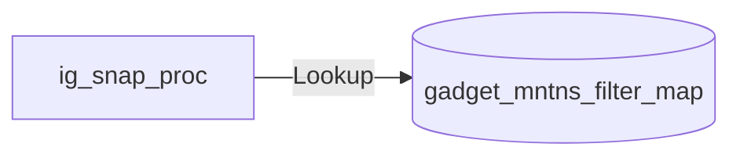
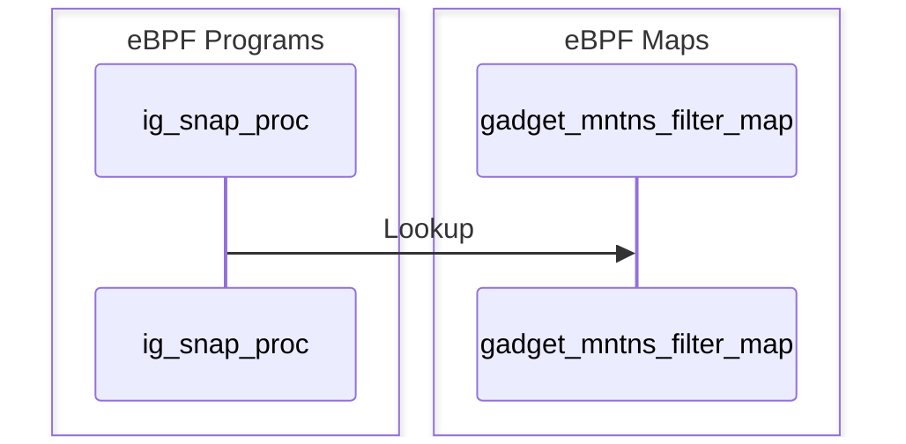

import Tabs from '@theme/Tabs';
import TabItem from '@theme/TabItem';

The `snapshot_process` shows running processes.

## Getting started

Running the gadget:

<Tabs groupId="env">
    <TabItem value="kubectl-gadget" label="kubectl gadget">
        ```bash
        $ kubectl gadget run ghcr.io/inspektor-gadget/gadget/snapshot_process:%IG_TAG% [flags]
        ```
    </TabItem>

    <TabItem value="ig" label="ig">
        ```bash
        $ sudo ig run ghcr.io/inspektor-gadget/gadget/snapshot_process:%IG_TAG% [flags]
        ```
    </TabItem>
</Tabs>

## Flags

### `--threads`

Show all threads (by default, only processes are shown)

Default value: "false"

## Guide

Run a pod / container:

<Tabs groupId="env">
<TabItem value="kubectl-gadget" label="kubectl gadget">
```bash
$ kubectl run --restart=Never --image=busybox test-snapshot-process -- sh -c 'sleep inf'
pod/test-snapshot-process created
```
</TabItem>

<TabItem value="ig" label="ig">
```bash
$ docker run --name test-snapshot-process -d busybox /bin/sh -c 'sleep inf'
...
```
</TabItem>
</Tabs>

Then, run the gadget and see how it shows the sleep process:

<Tabs groupId="env">
<TabItem value="kubectl-gadget" label="kubectl gadget">
```bash
$ kubectl gadget run snapshot_process:%IG_TAG%
K8S.NODE            K8S.NAMESPACE       K8S.PODNAME         K8S.CONTAINERNAME   COMM              PID        TID          PPID
minikube-docker     default             test-snap…t-process test-snapshot-proce sh             530932     530932        530911
^C
```

</TabItem>

<TabItem value="ig" label="ig">
```bash
$ sudo ig run snapshot_process:%IG_TAG% -c test-snapshot-process
RUNTIME.CONTAINERNAME           COMM                            PID               TID             PPID
test-snapshot-process           sh                           524665            524665           524645
^C
```
</TabItem>
</Tabs>

Finally, clean the system:

<Tabs groupId="env">
<TabItem value="kubectl-gadget" label="kubectl gadget">
```bash
$ kubectl delete pod test-snapshot-process
```
</TabItem>

<TabItem value="ig" label="ig">
```bash
$ docker rm -f test-snapshot-process
```
</TabItem>
</Tabs>

## Program-Map Relationships

### Flowchart Graph

Mermaid graph showing relations between maps and programs


### Sequence Graph 

Mermaid graph showing the sequence of events

