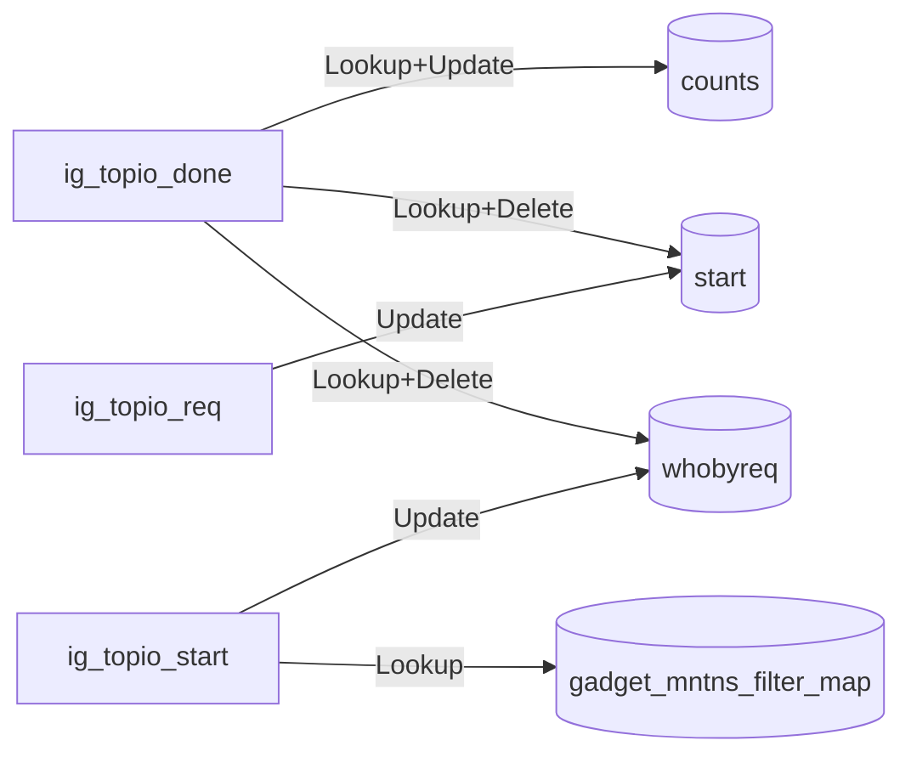
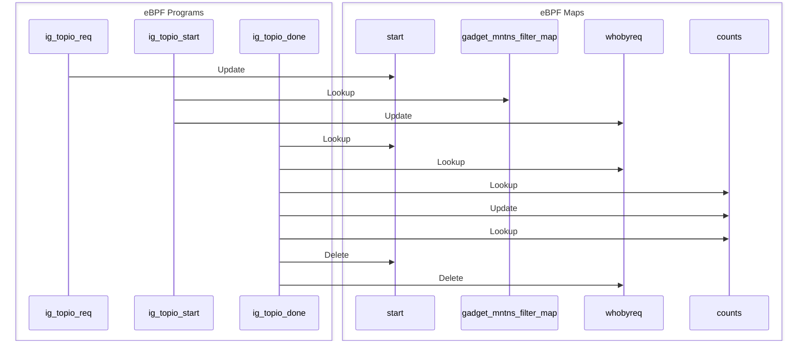

import Tabs from '@theme/Tabs';
import TabItem from '@theme/TabItem';

# top_blockio

The top_blockio gadget provides a periodic list of input/output block device activity.
This gadget requires Linux Kernel Version 6.5+.

Note: If you have an encrypted disk some block IO operations will not be shown, since device mappers are in between these operations to operate transparently. See https://docs.kernel.org/admin-guide/device-mapper/dm-crypt.html

## Getting started

Running the gadget:

<Tabs groupId="env">
    <TabItem value="kubectl-gadget" label="kubectl gadget">
        ```bash
        $ kubectl gadget run ghcr.io/inspektor-gadget/gadget/top_blockio:%IG_TAG%
        ```
    </TabItem>

    <TabItem value="ig" label="ig">
        ```bash
        $ sudo ig run ghcr.io/inspektor-gadget/gadget/top_blockio:%IG_TAG%
        ```
    </TabItem>
</Tabs>

## Guide

Run a pod / container:

<Tabs groupId="env">
    <TabItem value="kubectl-gadget" label="kubectl gadget">
        ```bash
        $ kubectl run --restart=Never --image=busybox test-top-blockio -- sh -c 'while true; do dd if=/dev/zero of=/tmp/test count=4096; sync; sleep 0.2; done'
        pod/test-top-blockio created
        ```
    </TabItem>

    <TabItem value="ig" label="ig">
        ```bash
        $ docker run --name test-top-blockio -d busybox /bin/sh -c 'while true; do dd if=/dev/zero of=/tmp/test count=4096; sync; sleep 0.2; done'
        ...
        ```
    </TabItem>
</Tabs>

Then, run the gadget and see how it shows the sync process:

<Tabs groupId="env">
    <TabItem value="kubectl-gadget" label="kubectl gadget">
        ```bash
        $ kubectl gadget run top_blockio:%IG_TAG%
        K8S.NODE            K8S.NAMESPACE       K8S.PODNAME         K8S.CONTAINERNAME          PID MAJOR      MINOR      COMM       BYTES      US        IO        RW 
        minikube            default             test-top-blockio    test-top-blockio          8086 8          0          sync       81920      45        1         wr…
        minikube            default             test-top-blockio    test-top-blockio          8055 8          0          sync       606208     547       3         wr…
        minikube            default             test-top-blockio    test-top-blockio          8082 8          0          sync       65536      95        2         wr…
        minikube            default             test-top-blockio    test-top-blockio          8084 8          0          sync       147456     95        2         wr…
        ...
        ```
    </TabItem>

    <TabItem value="ig" label="ig">
        ```bash
        $ sudo ig run top_blockio:%IG_TAG% -c test-top-blockio
        RUNTIME.CONTAINERNAME                                PID MAJOR       MINOR       COMM             BYTES                US                   IO         RW     
        test-top-blockio                                   11723 8           0           sync             212992               747                  3          write  
        test-top-blockio                                   11727 8           0           sync             65536                75                   1          write  
        ...
        ```
    </TabItem>
</Tabs>

Finally, clean the system:

<Tabs groupId="env">
<TabItem value="kubectl-gadget" label="kubectl gadget">
```bash
$ kubectl delete pod test-top-blockio
```
</TabItem>

<TabItem value="ig" label="ig">
```bash
$ docker rm -f test-top-blockio
```
</TabItem>
</Tabs>

## Program-Map Relationships

### Flowchart Graph

Mermaid graph showing relations between maps and programs


### Sequence Graph 

Mermaid graph showing the sequence of events

