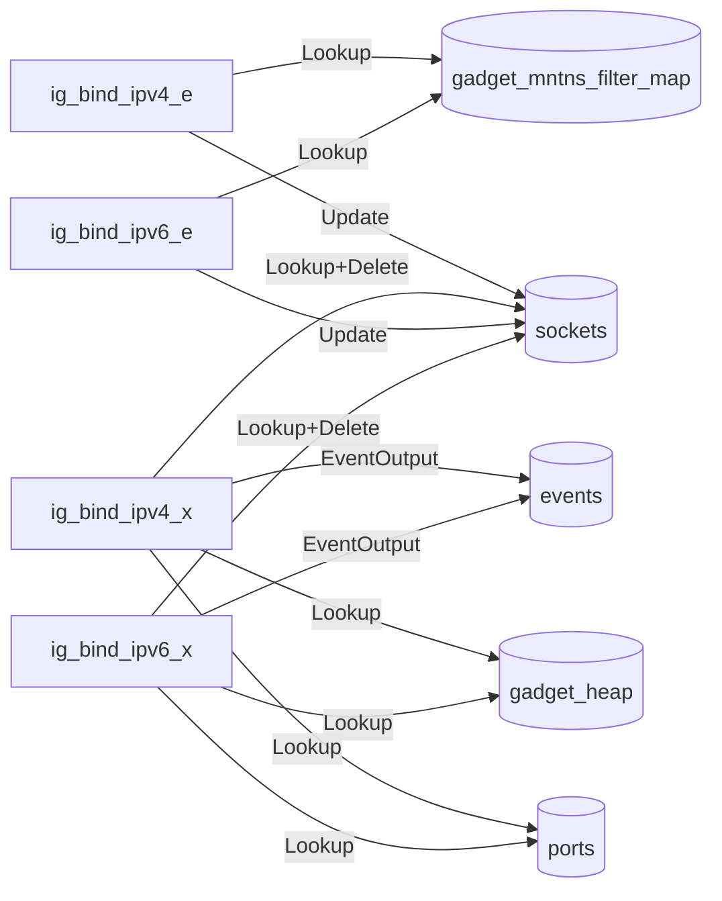
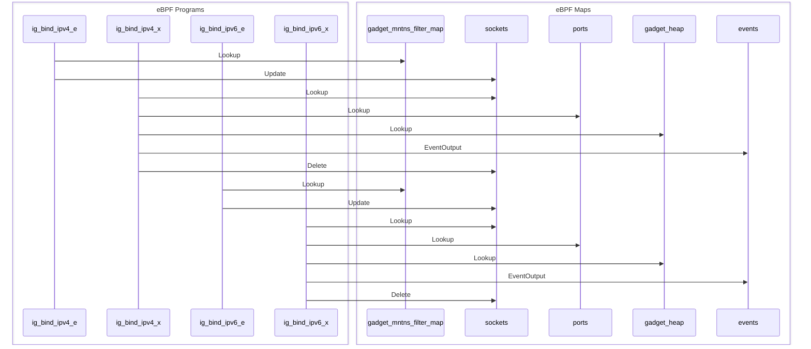

import Tabs from '@theme/Tabs';
import TabItem from '@theme/TabItem';

# trace_bind

The trace_bind gadget is used to stream socket binding syscalls.

## Getting started

Running the gadget:

<Tabs groupId="env">
    <TabItem value="kubectl-gadget" label="kubectl gadget">
        ```bash
        $ kubectl gadget run ghcr.io/inspektor-gadget/gadget/trace_bind:%IG_TAG% [flags]
        ```
    </TabItem>

    <TabItem value="ig" label="ig">
        ```bash
        $ sudo ig run ghcr.io/inspektor-gadget/gadget/trace_bind:%IG_TAG% [flags]
        ```
    </TabItem>
</Tabs>
## Flags

### `--ignore-errors`

Show only events where the bind succeeded

Default value: "true"

## Guide

First, we need to run an application that generates some events.

<Tabs groupId="env">
    <TabItem value="kubectl-gadget" label="kubectl gadget">
        ```bash
        $ kubectl run --restart=Never --image=busybox mypod -- sh -c 'while /bin/true ; do nc -l -p 4242 -w 1 ; sleep 3 ; done'
        pod/mypod created
        ```
    </TabItem>

    <TabItem value="ig" label="ig">
        ```bash
        $ docker run --name test-trace-bind -d busybox /bin/sh -c 'while /bin/true ; do nc -l -p 4242 -w 1 ; sleep 3 ; done'
        ```
    </TabItem>
</Tabs>

Then, let's run the gadget:

<Tabs groupId="env">
    <TabItem value="kubectl-gadget" label="kubectl gadget">
        ```bash
        $ kubectl gadget run trace_bind:%IG_TAG% --podname mypod
        K8S.NODE            K8S.NAMESPACE            K8S.PODNAME              K8S.CONTAINERNAME        ADDR                       COMM                    PID           TID          BOUND_… ERROR
        minikube-docker     default                  mypod                    mypod                    :::4242                    nc                   635160        635160          0
        minikube-docker     default                  mypod                    mypod                    :::4242                    nc                   635213        635213          0
        minikube-docker     default                  mypod                    mypod                    :::4242                    nc                   635233        635233          0
        minikube-docker     default                  mypod                    mypod                    :::4242                    nc                   635301        635301          0
        ```

    </TabItem>

    <TabItem value="ig" label="ig">
        ```bash
        $ sudo ig run trace_bind:%IG_TAG% --containername test-trace-bind
        RUNTIME.CONTAINERNAME               ADDR                                  COMM                            PID                TID                BOUND_DEV_… ERROR
        test-trace-bind                     :::4242                               nc                           647422             647422                0
        test-trace-bind                     :::4242                               nc                           647472             647472                0
        ^C
        ```
    </TabItem>
</Tabs>

These lines correspond to the socket binding operation initiated by `nc`.
We can stop the gadget by hitting Ctrl-C.

Finally, clean the system:

<Tabs groupId="env">
    <TabItem value="kubectl-gadget" label="kubectl gadget">
        ```bash
        $ kubectl delete pod mypod
        ```
    </TabItem>

    <TabItem value="ig" label="ig">
        ```bash
        $ docker rm -f test-trace-bind
        ```
    </TabItem>
</Tabs>

## Program-Map Relationships

### Flowchart Graph

Mermaid graph showing relations between maps and programs


### Sequence Graph 

Mermaid graph showing the sequence of events

