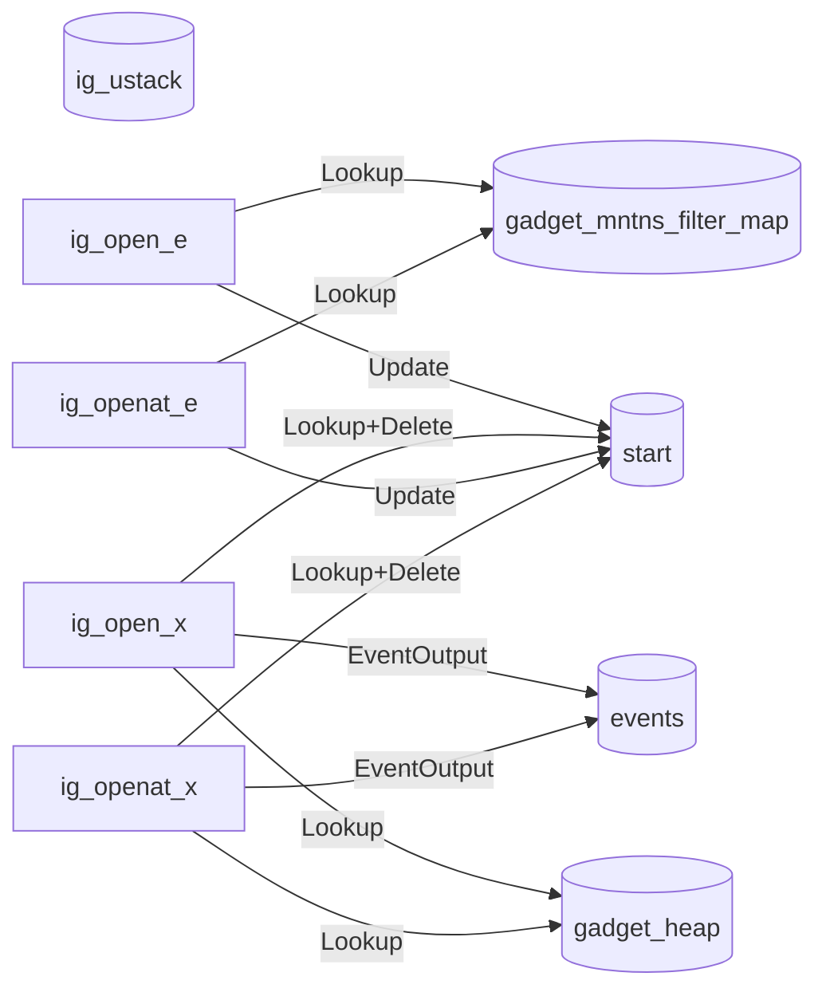
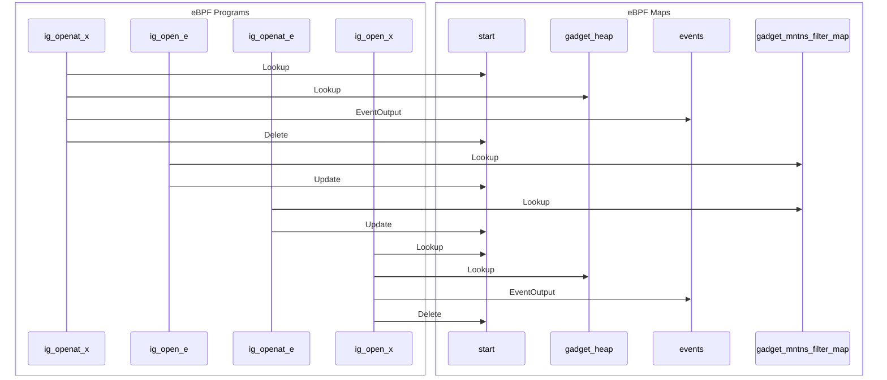

import Tabs from '@theme/Tabs';
import TabItem from '@theme/TabItem';

# trace_open

The trace_open gadget emits events when files are opened.

## Getting started

Running the gadget:

<Tabs groupId="env">
  <TabItem value="kubectl-gadget" label="kubectl gadget">
```bash
$ kubectl gadget run ghcr.io/inspektor-gadget/gadget/trace_open:%IG_TAG% [flags]
```
  </TabItem>

  <TabItem value="ig" label="ig">
```bash
$ sudo ig run ghcr.io/inspektor-gadget/gadget/trace_open:%IG_TAG% [flags]
```
  </TabItem>
</Tabs>
## Flags

### `--collect-ustack`

Collect user stack traces

Default value: "false"

### `--failed`

Show only failed events

Default value: "false"

## Guide

This example shows how to use this gadget.

First, we need to run an application that generates some events.

<Tabs groupId="env">
  <TabItem value="kubectl-gadget" label="kubectl gadget">
```bash
$ kubectl run --restart=Never --image=busybox mypod -- sh -c 'while /bin/true ; do whoami ; sleep 3 ; done'
pod/mypod created
```
  </TabItem>

  <TabItem value="ig" label="ig">
```bash
$ docker run --name test-trace-open -d busybox /bin/sh -c 'while /bin/true ; do whoami ; sleep 3 ; done'
```
  </TabItem>
</Tabs>

Then, let's run the gadget:

<Tabs groupId="env">
  <TabItem value="kubectl-gadget" label="kubectl gadget">
Using the trace_open gadget, we can see which processes open what files.
We can simply filter for the pod "mypod" and omit specifying the node,
thus tracing on all nodes for a pod called "mypod":

```bash
$ kubectl gadget run trace_open:%IG_TAG% --podname mypod
K8S.NODE           K8S.NAMESPACE K8S.PODNAME   K8S.CONTAINE… COMM        PID     TID      FD FNAME                    MODE    ERROR
minikube-docker    default       mypod         mypod         true     511559  511559       0 /etc/ld.so.cache         ------… ENOEN
minikube-docker    default       mypod         mypod         true     511559  511559       0 /lib/x86_64-linux-gnu/g… ------… ENOEN
minikube-docker    default       mypod         mypod         true     511559  511559       0 /lib/x86_64-linux-gnu/g… ------… ENOEN
minikube-docker    default       mypod         mypod         true     511559  511559       0 /lib/x86_64-linux-gnu/t… ------… ENOEN
minikube-docker    default       mypod         mypod         true     511559  511559       0 /lib/x86_64-linux-gnu/t… ------… ENOEN
minikube-docker    default       mypod         mypod         true     511559  511559       0 /lib/x86_64-linux-gnu/t… ------… ENOEN
minikube-docker    default       mypod         mypod         true     511559  511559       0 /lib/x86_64-linux-gnu/t… ------… ENOEN
minikube-docker    default       mypod         mypod         true     511559  511559       0 /lib/x86_64-linux-gnu/x… ------… ENOEN
minikube-docker    default       mypod         mypod         true     511559  511559       0 /lib/x86_64-linux-gnu/x… ------… ENOEN
minikube-docker    default       mypod         mypod         true     511559  511559       0 /lib/x86_64-linux-gnu/x… ------… ENOEN
minikube-docker    default       mypod         mypod         true     511559  511559       0 /lib/x86_64-linux-gnu/l… ------… ENOEN
...
minikube-docker    default       mypod         mypod         whoami   511560  511560       0 /lib/x86_64/libm.so.6    ------… ENOEN
minikube-docker    default       mypod         mypod         whoami   511560  511560       3 /lib/libm.so.6           ------…
minikube-docker    default       mypod         mypod         whoami   511560  511560       3 /lib/libresolv.so.2      ------…
minikube-docker    default       mypod         mypod         whoami   511560  511560       3 /lib/libc.so.6           ------…
minikube-docker    default       mypod         mypod         whoami   511560  511560       3 /etc/passwd              ------…
^C
```

Seems the whoami command opens "/etc/passwd" to map the user ID to a user name.
We can stop the gadget by hitting Ctrl-C.

  </TabItem>

  <TabItem value="ig" label="ig">
```bash
$ sudo ig run trace_open:%IG_TAG% --containername test-trace-open
RUNTIME.CONTAINERNA… COMM                PID         TID         FD FNAME                    MODE       ERROR
test-trace-open      true             515458      515458          0 /etc/ld.so.cache         ---------- ENOENT
test-trace-open      true             515458      515458          0 /lib/x86_64-linux-gnu/g… ---------- ENOENT
test-trace-open      true             515458      515458          0 /lib/x86_64-linux-gnu/g… ---------- ENOENT
test-trace-open      true             515458      515458          0 /lib/x86_64-linux-gnu/t… ---------- ENOENT
test-trace-open      true             515458      515458          0 /lib/x86_64-linux-gnu/t… ---------- ENOENT
test-trace-open      true             515458      515458          0 /lib/x86_64-linux-gnu/t… ---------- ENOENT
test-trace-open      true             515458      515458          0 /lib/x86_64-linux-gnu/t… ---------- ENOENT
test-trace-open      true             515458      515458          0 /lib/x86_64-linux-gnu/x… ---------- ENOENT
test-trace-open      true             515458      515458          0 /lib/x86_64-linux-gnu/x… ---------- ENOENT
test-trace-open      true             515458      515458          0 /lib/x86_64-linux-gnu/x… ---------- ENOENT
...
test-trace-open      whoami           515459      515459          0 /lib/tls/x86_64/libm.so… ---------- ENOENT
test-trace-open      whoami           515459      515459          0 /lib/tls/libm.so.6       ---------- ENOENT
test-trace-open      whoami           515459      515459          0 /lib/x86_64/x86_64/libm… ---------- ENOENT
test-trace-open      whoami           515459      515459          0 /lib/x86_64/libm.so.6    ---------- ENOENT
test-trace-open      whoami           515459      515459          0 /lib/x86_64/libm.so.6    ---------- ENOENT
test-trace-open      whoami           515459      515459          3 /lib/libm.so.6           ----------
test-trace-open      whoami           515459      515459          3 /lib/libresolv.so.2      ----------
test-trace-open      whoami           515459      515459          3 /lib/libc.so.6           ----------
test-trace-open      whoami           515459      515459          3 /etc/passwd              ----------
^C
```
  </TabItem>
</Tabs>

Finally, clean the system:

<Tabs groupId="env">
  <TabItem value="kubectl-gadget" label="kubectl gadget">
```bash
$ kubectl delete pod mypod
```
  </TabItem>

  <TabItem value="ig" label="ig">
```bash
$ docker rm -f test-trace-open
```
  </TabItem>
</Tabs>

## Program-Map Relationships

### Flowchart Graph

Mermaid graph showing relations between maps and programs


### Sequence Graph 

Mermaid graph showing the sequence of events

