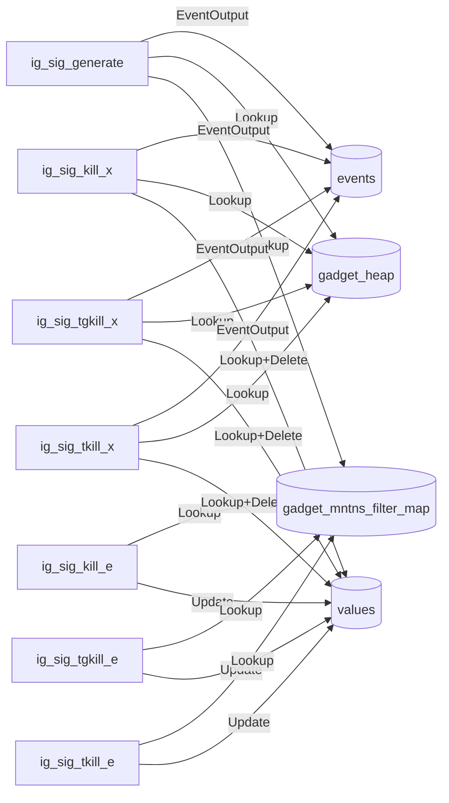
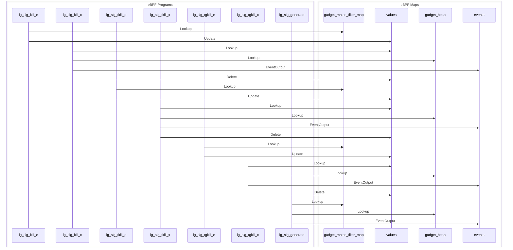

import Tabs from '@theme/Tabs';
import TabItem from '@theme/TabItem';

# trace signal

trace signal

## Getting started

Running the gadget:

<Tabs groupId="env">
    <TabItem value="kubectl-gadget" label="kubectl gadget">
        ```bash
        $ kubectl gadget run ghcr.io/inspektor-gadget/gadget/trace_signal:%IG_TAG% [flags]
        ```
    </TabItem>

    <TabItem value="ig" label="ig">
        ```bash
        $ sudo ig run ghcr.io/inspektor-gadget/gadget/trace_signal:%IG_TAG% [flags]
        ```
    </TabItem>
</Tabs>

## Flags

### `--failed`

Show only failed events

Default value: "false"

### `--kill-only`

Show only events generated by kill family syscalls

Default value: "false"

### `--signal`

Show only events generated by this signal

Default value: ""

## Guide

TODO

## Program-Map Relationships

### Flowchart Graph

Mermaid graph showing relations between maps and programs


### Sequence Graph 

Mermaid graph showing the sequence of events

