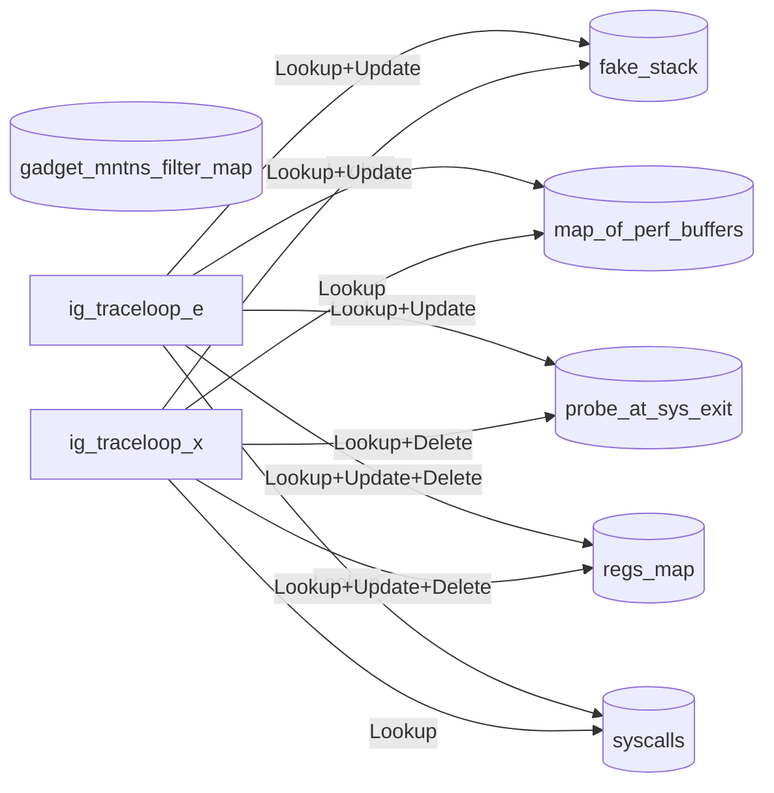
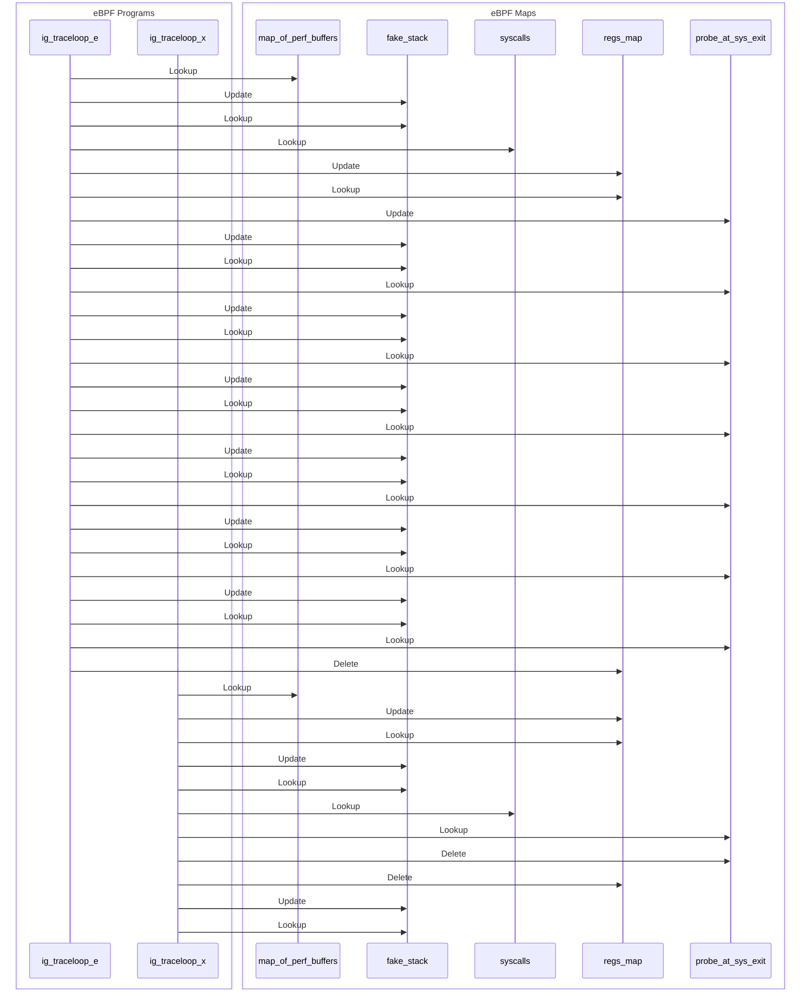

import Tabs from '@theme/Tabs';
import TabItem from '@theme/TabItem';

# traceloop

The traceloop gadget is a syscalls flight recorder.

## Getting started

Running the gadget:

<Tabs groupId="env">
    <TabItem value="kubectl-gadget" label="kubectl gadget">
        Unsupported
    </TabItem>

    <TabItem value="ig" label="ig">
        ```bash
        $ sudo ig run ghcr.io/inspektor-gadget/gadget/traceloop:%IG_TAG% [flags]
        ```
    </TabItem>
</Tabs>

## Guide

First, we need to run an application that generates some events.

<Tabs groupId="env">
    <TabItem value="kubectl-gadget" label="kubectl gadget">
        Unsupported
    </TabItem>

    <TabItem value="ig" label="ig">
        ```bash
        $ docker run -it --rm --name test-traceloop busybox /bin/sh
        ```
    </TabItem>
</Tabs>

Then, let's run the gadget:

<Tabs groupId="env">
    <TabItem value="kubectl-gadget" label="kubectl gadget">
        Unsupported
    </TabItem>

    <TabItem value="ig" label="ig">
        ```bash
        $ sudo ig run traceloop:%IG_TAG% --containername test-traceloop
        RUNTIME.CONTAINERNAME                        CPU         PID COMM             SYSCALL                     PARAMETERS                  RET
        ```
    </TabItem>
</Tabs>

Now, let's generate some events:

<Tabs groupId="env">
    <TabItem value="kubectl-gadget" label="kubectl gadget">
        Unsupported
    </TabItem>

    <TabItem value="ig" label="ig">
        Run a command inside the container:

        ```bash
        / # ls
        ```
    </TabItem>
</Tabs>

Let's collect the syscalls:

<Tabs groupId="env">
    <TabItem value="kubectl-gadget" label="kubectl gadget">
        Unsupported
    </TabItem>

    <TabItem value="ig" label="ig">
        Press Ctrl+C to collect the syscalls:

        ```bash
        $ sudo ig run traceloop:%IG_TAG% --containername test-traceloop
        RUNTIME.CONTAINERNAME                        CPU         PID COMM             SYSCALL                     PARAMETERS                  RET
        ...
        test-traceloop                            5         58054 sh               execve                    filename="/bin/ls", a…             0
        test-traceloop                            5         58054 ls               brk                       brk=0                  102559763509…
        test-traceloop                            5         58054 ls               mmap                      addr=0, len=8192, pro… 123786398932…
        test-traceloop                            5         58054 ls               access                    filename="/etc/ld.so.… -1 (Permissi…
        ...
        test-traceloop                            5         58054 ls               write                     fd=1, buf="\x1b[1;34m…           201
        test-traceloop                            5         58054 ls               exit_group                error_code=0                       X
        ...
        ```
    </TabItem>
</Tabs>

Finally, clean the system:

<Tabs groupId="env">
    <TabItem value="kubectl-gadget" label="kubectl gadget">
        Unsupported
    </TabItem>

    <TabItem value="ig" label="ig">
        ```bash
        $ docker rm -f test-traceloop
        ```
    </TabItem>
</Tabs>

## Limitations

This gadget has the following limitations:
1. It cannot be run in kubernetes context.
2. Timestamps are not filled on kernel older than 5.7.

## Program-Map Relationships

### Flowchart Graph

Mermaid graph showing relations between maps and programs


### Sequence Graph 

Mermaid graph showing the sequence of events

